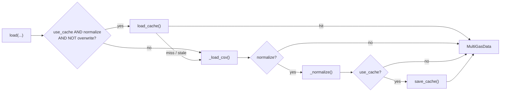

# API Reference

Public API surface of the `multigas` package. Each entry lists the callable
signature followed by a parameter table. Parameters without a default are
required.

> Back to [Home](Home.md).

---

## Table of Contents

- [Top-level exports](#top-level-exports)
  - [`read_file`](#read_file)
  - [`DataLoader`](#dataloader)
- [Core container class](#core-container-class)
  - [`MultiGasData`](#multigasdata)
    - [`add_wind_direction`](#add_wind_direction)
    - [`add_wind_quadrant`](#add_wind_quadrant)
    - [`extract_daily`](#extract_daily)
    - [`to_csv`](#to_csv)
    - [`to_excel`](#to_excel)
- [Query mixin (inherited by `MultiGasData`)](#query-mixin)
  - Properties: [`missing_columns`](#missing_columns), [`empty_columns`](#empty_columns)
  - [`select_columns`](#select_columns)
  - [`select_numeric_columns`](#select_numeric_columns)
  - [`reset_selected_columns`](#reset_selected_columns)
  - [`refresh`](#refresh)
  - [`is_filtered`](#is_filtered)
  - [`column_has_missing`](#column_has_missing)
  - [`column_is_empty`](#column_is_empty)
  - [`count`](#count)
  - [`where`](#where)
  - [`where_date`](#where_date)
  - [`where_date_between`](#where_date_between)
  - [`where_values_between`](#where_values_between)
  - [`get`](#get)
  - Static helpers: [`intersection`](#intersection), [`unique`](#unique)
- [Enums](#enums)
  - [`DatasetType`](#datasettype)
  - [`SensorStatus`](#sensorstatus)
  - [`FileFormat`](#fileformat)
  - [`LogLevel`](#loglevel)
- [Type aliases and TypedDicts](#type-aliases-and-typeddicts)
- [Exceptions](#exceptions)
- [Logging (`multigas.logging`)](#logging-multigaslogging)
- [Utilities](#utilities)
  - [`multigas.utils.path`](#multigasutilspath)
  - [`multigas.utils.cache`](#multigasutilscache)
  - [`multigas.utils.validation`](#multigasutilsvalidation)
  - [`multigas.utils.dataframe`](#multigasutilsdataframe)
- [Plotting (`multigas.plot`)](#plotting-multigasplot)
  - [`plot_completeness`](#plot_completeness)
- [Constants (`multigas.core.constant`)](#constants-multigascoreconstant)

---

## Top-level exports

Importable directly from the `multigas` namespace.

### `read_file`

Module: `multigas.core.io` (re-exported as `multigas.read_file`)

```python
read_file(
    file_path: Path | str,
    dataset_type: DatasetType | str,
    index_col: str = "TIMESTAMP",
    drop_empty_columns: bool = False,
    normalize: bool = True,
    use_cache: bool = True,
    output_dir: Path | str | None = None,
    cache_dir: Path | str | None = None,
    overwrite: bool = False,
    verbose: bool = False,
) -> MultiGasData
```

One-call convenience wrapper around `DataLoader`. Constructs the loader,
calls `.load()`, and returns the `MultiGasData` result.

| Arg | Type | Default | Description |
|---|---|---|---|
| `file_path` | `Path \| str` | — | Path to the source CSV / TOA5 file. |
| `dataset_type` | `DatasetType \| str` | — | Dataset identifier — a `DatasetType` member or its string value (`"1s"`, `"2s"`, `"1min"`, `"6h"`, `"zero"`, `"span"`, `"wx"`). |
| `index_col` | `str` | `"TIMESTAMP"` | Column to promote to the `pd.DatetimeIndex`. Case-sensitive; must exist in the source. |
| `drop_empty_columns` | `bool` | `False` | Drop columns that are entirely NaN after normalisation. |
| `normalize` | `bool` | `True` | Replace NAN sentinel strings with `np.nan`, drop duplicate timestamps (keeping the last row), and coerce object columns to numeric where possible. |
| `use_cache` | `bool` | `True` | Read from / write to the on-disk `joblib` cache when `normalize=True`. |
| `output_dir` | `Path \| str \| None` | `None` (→ `<cwd>/output`) | Root output directory. |
| `cache_dir` | `Path \| str \| None` | `None` (→ `<output_dir>/cache`) | Directory for `.pkl` cache entries. |
| `overwrite` | `bool` | `False` | Ignore any existing cache entry and re-load from source. |
| `verbose` | `bool` | `False` | Emit informational log messages during loading. |

**Returns:** `MultiGasData` — wraps the loaded DataFrame, the resolved
`DatasetType`, and the absolute source path.

**Raises:** `LoaderError` — file not found, invalid `dataset_type`, parse
failure, or `index_col` missing from the loaded frame.

---

### `DataLoader`

Module: `multigas.data.loader` (re-exported as `multigas.DataLoader`)

Full-control loader used by `read_file` under the hood. Reads TOA5 or plain
CSV files, optionally normalises them, and manages an on-disk `joblib` cache
keyed by absolute path + mtime.

#### `DataLoader.__init__`

```python
DataLoader(
    output_dir: Path | str | None = None,
    cache_dir: Path | str | None = None,
    overwrite: bool = False,
    verbose: bool = False,
)
```

| Arg | Type | Default | Description |
|---|---|---|---|
| `output_dir` | `Path \| str \| None` | `None` (→ `<cwd>/output`) | Root output directory. Also parents the `normalized/` copy of every loaded file. |
| `cache_dir` | `Path \| str \| None` | `None` (→ `<output_dir>/cache`) | Directory that will hold cache entries. |
| `overwrite` | `bool` | `False` | If `True`, subsequent `.load()` calls skip the cache lookup. |
| `verbose` | `bool` | `False` | Emit informational log messages during loading. |

**Instance attributes populated by `__init__`:**

| Attribute | Type | Description |
|---|---|---|
| `basename` | `str \| None` | `file_path.stem` of the most recent load (used for naming the normalised CSV copy). |
| `output_dir` | `Path` | Root output directory. |
| `normalize_dir` | `Path` | `<output_dir>/normalized`. |
| `cache_dir` | `Path` | Directory holding `.pkl` cache entries. |
| `overwrite` | `bool` | Skip cache lookup on the next `.load()` call. |
| `metadata` | `DatasetMetadataDict \| None` | TOA5 metadata (populated by future loader work). |
| `verbose` | `bool` | Emit info logs during loading. |

#### `DataLoader.load`

```python
DataLoader.load(
    file_path: Path | str,
    dataset_type: DatasetType | str,
    index_col: str = "TIMESTAMP",
    drop_empty_columns: bool = False,
    normalize: bool = True,
    use_cache: bool = True,
) -> MultiGasData
```

| Arg | Type | Default | Description |
|---|---|---|---|
| `file_path` | `Path \| str` | — | Path to the source CSV / TOA5 file. |
| `dataset_type` | `DatasetType \| str` | — | Dataset identifier — a `DatasetType` member or its string value. |
| `index_col` | `str` | `"TIMESTAMP"` | Column to promote to the `pd.DatetimeIndex`. Case-sensitive. |
| `drop_empty_columns` | `bool` | `False` | Drop columns entirely NaN after normalisation (only when `normalize=True`). |
| `normalize` | `bool` | `True` | Replace NAN sentinel strings with `np.nan`, drop duplicate timestamps (keeping the last row), and coerce object columns to numeric. |
| `use_cache` | `bool` | `True` | Read from / write to the on-disk cache. Caching only applies when `normalize=True`. |

**Returns:** `MultiGasData`.

**Raises:** `LoaderError` — invalid `dataset_type`, file missing, parse
failure, or `index_col` missing.

**Cache flow:**



---

## Core container class

### `MultiGasData`

Module: `multigas.data.multigas_data` (also re-exported as `multigas.data.MultiGasData`)

```python
class MultiGasData(Query):
    def __init__(
        self,
        df: pd.DataFrame,
        dataset_type: DatasetType,
        source_path: Path,
        index_col: str = "TIMESTAMP",
        verbose: bool = False,
    ): ...
```

Wraps a loaded DataFrame together with its provenance metadata. Inherits
all methods and properties from [`Query`](#query-mixin), so column selection
and row filtering chain directly on the result.

| Field | Type | Default | Description |
|---|---|---|---|
| `df` | `pd.DataFrame` | — | The loaded (and optionally normalised) DataFrame. |
| `dataset_type` | `DatasetType` | — | The dataset type as declared by the caller. |
| `source_path` | `Path` | — | Absolute path to the original source file. |
| `index_col` | `str` | `"TIMESTAMP"` | Column used as the datetime index. |
| `verbose` | `bool` | `False` | Whether Query operations emit log messages. |

`__init__` delegates to `super().__init__(df, index_col, verbose)` (i.e.
[`Query.__init__`](#query-mixin)), which promotes `index_col` to a
`pd.DatetimeIndex`, stashes a pristine `df_original`, and computes
`numeric_columns` and the `start_date` / `end_date` bounds. The
`dataset_type` and `source_path` fields are assigned after the
super-call.

#### `add_wind_direction`

```python
MultiGasData.add_wind_direction(
    wind_direction_column_name: str,
    as_code: bool = False,
    direction_to_use: Literal[16, 8, 4] = 16,
) -> Self
```

Append a `wind_direction` column derived from a bearings column. Bearings
are normalised modulo 360; `NaN` inputs produce `None` (no row is dropped).

| Arg | Type | Default | Description |
|---|---|---|---|
| `wind_direction_column_name` | `str` | — | Name of the source column holding bearings in degrees. |
| `as_code` | `bool` | `False` | If `True`, emit short codes (`"N"`, `"NE"`, …); otherwise full names (`"North"`, `"Northeast"`, …). |
| `direction_to_use` | `Literal[16, 8, 4]` | `16` | Number of compass sectors. |

**Returns:** `Self` — for fluent chaining.

**Raises:** `ColumnError` if the source column is missing; `ValidationError`
if a finite bearing cannot be mapped to any sector.

#### `add_wind_quadrant`

```python
MultiGasData.add_wind_quadrant(
    wind_direction_column_name: str,
    as_code: bool = False,
    quadrant_to_use: Literal[8, 4] = 8,
) -> Self
```

Append a `wind_quadrant` column derived from a bearings column. Bearings
are normalised modulo 360; `NaN` inputs produce `None`.

| Arg | Type | Default | Description |
|---|---|---|---|
| `wind_direction_column_name` | `str` | — | Name of the source column holding bearings in degrees. |
| `as_code` | `bool` | `False` | If `True`, emit short codes (`"I"`, `"II"`, …); otherwise full names (`"Quadrant I"`, …). |
| `quadrant_to_use` | `Literal[8, 4]` | `8` | Number of quadrants. |

**Returns:** `Self`.

**Raises:** `ColumnError` if the source column is missing; `ValidationError`
if a finite bearing cannot be mapped to any quadrant.

#### `to_csv`

```python
MultiGasData.to_csv(path: str | None = None) -> str
```

Write the working DataFrame to a CSV file. When `path` is omitted, the
file is written to `<cwd>/output/csv/<dataset_type>/<source_stem>.csv`.
Any explicit `path` is used verbatim, with a `.csv` suffix appended when
missing. The parent directory is created on demand.

| Arg | Type | Default | Description |
|---|---|---|---|
| `path` | `str \| None` | `None` | Destination path. When `None`, the file is written under `<cwd>/output/csv/<dataset_type>/` using the source file's stem. |

**Returns:** `str` — string representation of the written file path.

#### `to_excel`

```python
MultiGasData.to_excel(path: str | None = None) -> str
```

Write the working DataFrame to an Excel (`.xlsx`) file. When `path` is
omitted, the file is written to
`<cwd>/output/excel/<dataset_type>/<source_stem>.xlsx`. Any explicit
`path` is used verbatim, with a `.xlsx` suffix appended when missing.
The parent directory is created on demand. Excel writing uses the
`openpyxl` engine (a core runtime dependency).

| Arg | Type | Default | Description |
|---|---|---|---|
| `path` | `str \| None` | `None` | Destination path. When `None`, the file is written under `<cwd>/output/excel/<dataset_type>/` using the source file's stem. |

**Returns:** `str` — string representation of the written file path.

#### `extract_daily`

```python
MultiGasData.extract_daily(
    output_dir: Path | str | None = None,
    return_as_list: bool = False,
    n_jobs: int = 1,
    overwrite: bool = True,
    plot: bool = True,
) -> list[ExtractedStats] | pd.DataFrame
```

Split the working DataFrame by calendar day and write one CSV per day.
Iterates every day between the first and last timestamp of `df` (inclusive,
based on `df.index.min().normalize()` / `.max().normalize()`), writing the
rows for each day to
`<output_dir>/daily/<DatasetType.label>/<source_slug>/<YYYY-MM-DD>.csv`
(the dataset-type directory uses [`DatasetType.label`](#datasettype) —
the hyphenated form such as `"one-minute"`; `<source_slug>` is the
slugified source file stem) and collecting per-day
stats via [`calculate_completeness`](#multigasutilsdataframe) with
`as_percentage=True`. Days without data are skipped — no CSV is
written and they are omitted from the returned stats and every
summary file — and the full list of missing days is logged as a
`WARNING` at the end.

Alongside the per-day CSVs, the aggregated stats are persisted under
`<output_dir>/daily/<DatasetType.label>/`:

* `<source_slug>-completeness.csv` is always written, with columns
  `date`, `total_data`, `completeness`.
* When `plot=True` (the default), that CSV is rendered to
  `<source_slug>-completeness.png` via
  [`plot_completeness`](#plot_completeness), titled
  `"<source_stem> (<DatasetType.label>)"`. Plotting failures are
  logged at `WARNING` and never abort the extraction.
* When `return_as_list=True`, the raw `list[ExtractedStats]` is
  additionally written to `<source_slug>.json` via `json.dump` with
  `indent=4` and `ensure_ascii=False`.

When `n_jobs > 1`, per-day extraction is dispatched to
`joblib.Parallel` with the `loky` backend. The effective worker
count is capped at `max(1, os.cpu_count() - 2)` to leave headroom
for the main process and the OS. Job order is preserved, so the
returned per-day stats stay date-ordered regardless of worker
completion order. Per-day `verbose` info logs are suppressed in
workers to keep multi-process log output tidy — the aggregated
missing-days `WARNING` still fires once from the main process.

When `overwrite=False`, days whose CSV already exists under
`<output_dir>/daily/<DatasetType.label>/<source_slug>/` are left
alone — the write is skipped and the row's `total_data` is read back
from the file via [`count_csv_rows`](#multigasutilsdataframe) (line
count minus header) so the returned per-day shape (one row per
calendar day with data) stays intact. The check is per-file (each day
independent); a mix of "already-there" and "brand-new" days in the
same range is fine. Stats reported for kept-on-disk days reflect
the file on disk, not the current in-memory `df` — relevant if the
caller has narrowed `df` via, e.g., `where_date_between`. When at
least one day is skipped, an `INFO` line names the skipped count.

| Arg | Type | Default | Description |
|---|---|---|---|
| `output_dir` | `Path \| str \| None` | `None` | Destination root. When `None`, files are written under `<cwd>/output/`. |
| `return_as_list` | `bool` | `False` | If `True`, return the raw `list[ExtractedStats]` and additionally persist it as `<source_slug>.json`; otherwise return a `pd.DataFrame` with columns `date`, `total_data`, `completeness` (percentage). The `-completeness.csv` summary is written either way. |
| `n_jobs` | `int` | `1` | Number of parallel workers. `1` runs sequentially. Values `> 1` are capped at `max(1, os.cpu_count() - 2)` and dispatched to `joblib.Parallel` with the `loky` backend. |
| `overwrite` | `bool` | `True` | When `True`, every per-day CSV is (re)written, replacing any existing file. When `False`, days whose CSV already exists are left alone and their stats are read back from the file via `count_csv_rows`. |
| `plot` | `bool` | `True` | Render the completeness summary to `<source_slug>-completeness.png` via [`plot_completeness`](#plot_completeness). |

**Returns:** `list[ExtractedStats] | pd.DataFrame` — per-day stats, one
entry per calendar day in the source range that has data (missing
days are omitted). `completeness` is a percentage in `[0, 100]`.

---

## Query mixin

Module: `multigas.core.query`

Provides fluent column selection and row filtering. Every `MultiGasData`
inherits from this class. Mutating methods change `self.df` in place; the
pristine copy stays in `self.df_original` and is restored via
[`refresh()`](#refresh).

**Constructor (called from `MultiGasData.__init__` via `super().__init__`):**

```python
Query(df: pd.DataFrame, index_col: str | None = None, verbose: bool = False)
```

| Arg | Type | Default | Description |
|---|---|---|---|
| `df` | `pd.DataFrame` | — | DataFrame to wrap. Must contain `index_col` as a column or already have a `pd.DatetimeIndex`. |
| `index_col` | `str \| None` | `None` (→ `"TIMESTAMP"`) | Column name to use as the datetime index. |
| `verbose` | `bool` | `False` | Emit informational log messages for each operation. |

**Raises:** `ValueError` — when the resulting DataFrame is empty.

**Instance attributes:**

| Attribute | Type | Description |
|---|---|---|
| `df` | `pd.DataFrame` | Working DataFrame with a `pd.DatetimeIndex`. |
| `df_original` | `pd.DataFrame` | Untouched copy captured at construction. |
| `index_col` | `str` | Column promoted to the datetime index. |
| `columns` | `list[str]` | All column names in `df_original`. |
| `selected_columns` | `list[str]` | Currently selected column names. |
| `numeric_columns` | `list[str]` | Numeric-dtype columns in `df`. |
| `start_date` | `pd.Timestamp` | Earliest timestamp in `df`. |
| `end_date` | `pd.Timestamp` | Latest timestamp in `df`. |
| `start_date_str` | `str` | `start_date` formatted as `YYYY-MM-DD`. |
| `end_date_str` | `str` | `end_date` formatted as `YYYY-MM-DD`. |
| `verbose` | `bool` | Whether operations emit informational log messages. |

### Properties

#### `missing_columns`

```python
Query.missing_columns -> list[str]
```

Names of columns that contain at least one missing value (NaN / `pd.NA` for
every dtype, plus empty string for string-like dtypes). Restricted to
`selected_columns` when a selection is active; otherwise checks every
column.

#### `empty_columns`

```python
Query.empty_columns -> list[str]
```

Names of columns whose values are considered empty (all-NaN; additionally
all-zero for numeric or all-empty for object dtypes). Restricted to
`selected_columns` when a selection is active.

### Methods

#### `select_columns`

```python
Query.select_columns(
    column_names: str | list[str],
    numeric_column_only: bool = False,
    validate: bool = True,
) -> Self
```

| Arg | Type | Default | Description |
|---|---|---|---|
| `column_names` | `str \| list[str]` | — | Single name or list of names to select. |
| `numeric_column_only` | `bool` | `False` | If `True`, delegates to `select_numeric_columns` so non-numeric names are dropped. |
| `validate` | `bool` | `True` | Raise `ColumnError` when any name is missing from `self.columns`. |

**Returns:** `Self`.

**Raises:** `ColumnError` — when `validate=True` and any name is not in
`self.columns`.

#### `select_numeric_columns`

```python
Query.select_numeric_columns(
    column_names: str | list[str] | None = None,
    validate: bool = True,
) -> Self
```

| Arg | Type | Default | Description |
|---|---|---|---|
| `column_names` | `str \| list[str] \| None` | `None` | If `None`, selects all numeric columns. Otherwise selects the intersection of the names and `numeric_columns`. |
| `validate` | `bool` | `True` | Raise `ColumnError` when any name is not in `self.columns` (non-numeric names that *do* exist are silently dropped). |

**Returns:** `Self`.

**Raises:** `ColumnError` — when `validate=True` and any name is missing.

#### `reset_selected_columns`

```python
Query.reset_selected_columns() -> Self
```

Clear the current column selection. Emits a log line when `verbose=True`.

#### `refresh`

```python
Query.refresh() -> Self
```

Restore `self.df` to the pristine `df_original` copy. Also clears the
selection and recomputes `numeric_columns` and the date bounds.

#### `is_filtered`

```python
Query.is_filtered() -> bool
```

Return `True` when the working DataFrame no longer equals `df_original`.

#### `column_has_missing`

```python
Query.column_has_missing(column_name: str) -> bool
```

| Arg | Type | Default | Description |
|---|---|---|---|
| `column_name` | `str` | — | Column to inspect. |

**Returns:** `True` when the column has at least one NaN, `pd.NA`, or (for
string-like dtypes) empty string.

**Raises:** `ColumnError` — when `column_name` is not in `self.columns`.

#### `column_is_empty`

```python
Query.column_is_empty(column_name: str) -> bool
```

| Arg | Type | Default | Description |
|---|---|---|---|
| `column_name` | `str` | — | Column to inspect. |

**Returns:** `True` when the column is entirely NaN, all-zero (numeric),
or all-empty-string (object).

**Raises:** `ColumnError` — when `column_name` is not in `self.columns`.

#### `count`

```python
Query.count() -> int
```

Number of rows in `self.df`.

#### `where`

```python
Query.where(column_name: str, comparator: str, value: Any) -> Self
```

Filter `self.df` in place by comparing a column (or the index) against a
value. When `column_name` equals `self.df.index.name`, the comparison runs
against the `DatetimeIndex`.

| Arg | Type | Default | Description |
|---|---|---|---|
| `column_name` | `str` | — | Name of the column, or the index name. |
| `comparator` | `str` | — | One of the aliases in [`COMPARATOR`](#constants-multigascoreconstant) — symbolic (`">="`), English (`"greater than"`), or Indonesian (`"lebih besar sama dengan"`). |
| `value` | `Any` | — | Right-hand side of the comparison. |

**Returns:** `Self`.

**Raises:** `ValueError` — unknown comparator; `ColumnError` — unknown column.

#### `where_date`

```python
Query.where_date(date_str: str) -> Self
```

| Arg | Type | Default | Description |
|---|---|---|---|
| `date_str` | `str` | — | Partial-string date accepted by pandas — `"2025"`, `"2025-01"`, or `"2025-01-15"`. Bound is expanded to cover the whole year, month, or day. |

**Returns:** `Self`.

Uses the slice form `df.loc[date_str:date_str]` so the result stays a
`pd.DataFrame` even when only one row matches.

#### `where_date_between`

```python
Query.where_date_between(start_date: str, end_date: str) -> Self
```

| Arg | Type | Default | Description |
|---|---|---|---|
| `start_date` | `str` | — | Inclusive lower bound — any pandas partial-string date. |
| `end_date` | `str` | — | Inclusive upper bound — any pandas partial-string date. |

**Returns:** `Self`.

#### `where_values_between`

```python
Query.where_values_between(
    column_name: str,
    start_value: int | float,
    end_value: int | float,
) -> Self
```

| Arg | Type | Default | Description |
|---|---|---|---|
| `column_name` | `str` | — | Numeric column to filter on. |
| `start_value` | `int \| float` | — | Inclusive lower bound. |
| `end_value` | `int \| float` | — | Inclusive upper bound. |

**Returns:** `Self`.

**Raises:** `ColumnError` — when the column is missing or non-numeric.

#### `get`

```python
Query.get() -> pd.DataFrame
```

Narrow `self.df` to `self.selected_columns` (if any) and return it. When
no selection is active, returns `self.df` unchanged. **Mutating** — dropped
columns leave `self.df` for good and can only be brought back via
[`refresh()`](#refresh).

### Static helpers

#### `intersection`

```python
Query.intersection(first_list: list[str], second_list: list[str]) -> list[str]
```

Elements of `first_list` that also appear in `second_list`, in
`first_list` order (duplicates preserved). Prefer over `set.intersection`
when the caller needs ordering.

#### `unique`

```python
Query.unique(first_list: list[str], second_list: list[str]) -> list[str]
```

Deduplicated union of two lists. Order is not guaranteed (uses a set
internally).

---

## Enums

Module: `multigas.core.types` (re-exported from `multigas.core`).

### `DatasetType`

`StrEnum` whose values double as pandas frequency aliases where applicable.

| Member | Value | Meaning |
|---|---|---|
| `ONE_SECOND` | `"1s"` | 1-second sampling |
| `TWO_SECONDS` | `"2s"` | 2-second sampling |
| `SIX_HOURS` | `"6h"` | 6-hour sampling |
| `ONE_MINUTE` | `"1min"` | 1-minute sampling |
| `ZERO` | `"zero"` | Zero-calibration stream |
| `SPAN` | `"span"` | Span-calibration stream |
| `WX` | `"wx"` | Weather stream |

Unknown values raise `ValueError` via the custom `_missing_` hook and the
error message lists every valid value.

**`.total_data` property** — expected number of records per day for
sampling-interval members (used by
[`calculate_completeness`](#multigasutilsdataframe)):

| Member | `.total_data` |
|---|---|
| `ONE_SECOND` | `86400` |
| `TWO_SECONDS` | `5760` |
| `ONE_MINUTE` | `1440` |
| `SIX_HOURS` | `4` |
| `ZERO` | `4` |

`SPAN` and `WX` are categorical streams with no fixed per-day cadence —
accessing `.total_data` on either raises `ValueError` naming the members
that *are* supported.

**`.label` property** — human-readable, hyphenated form of each member,
used as a directory / file-name segment (e.g. by
[`extract_daily`](#extract_daily)):

| Member | `.label` |
|---|---|
| `ONE_SECOND` | `"one-second"` |
| `TWO_SECONDS` | `"two-second"` |
| `ONE_MINUTE` | `"one-minute"` |
| `SIX_HOURS` | `"six-hour"` |
| `ZERO` | `"zero"` |
| `SPAN` | `"span"` |
| `WX` | `"wx"` |

Deliberately named `label` — not `name` — so it doesn't shadow
`enum.Enum.name`, which the package's `_missing_` hook relies on. Safe
to call on every member of the enum.

### `SensorStatus`

`IntEnum` mapping datalogger status codes to `.description` strings.

| Member | Value | `.description` |
|---|---|---|
| `CHEMICAL_SENSOR_OFF` | `-2` | Chemical Sensor Off |
| `WARMING_UP` | `-1` | Warming Up |
| `ZERO` | `0` | Zero |
| `SAMPLE_ACQUISITION` | `1` | Sample Acquisition |
| `SPAN_CO2_SO2` | `4` | Standart Gas Measurement for CO2 and SO2 |
| `SPAN_H2S` | `6` | Standart Gas Measurement for H2S |
| `MANUAL_ZERO` | `10` | Manual Zero Measurement |
| `MANUAL_SAMPLE` | `11` | Manual Sample Measurement |
| `MANUAL_SPAN_CO2_SO2` | `14` | Manual Standart Gas Measurement for CO2 and SO2 |
| `MANUAL_SPAN_H2S` | `16` | Manual Standart Gas Measurement for H2S |

### `FileFormat`

`StrEnum` of writer output formats.

| Member | Value |
|---|---|
| `CSV` | `"csv"` |
| `EXCEL` | `"excel"` |
| `PARQUET` | `"parquet"` |
| `JSON` | `"json"` |

### `LogLevel`

`StrEnum` of loguru levels understood by the package logger.

| Member | Value |
|---|---|
| `DEBUG` | `"debug"` |
| `INFO` | `"info"` |
| `WARN` | `"warn"` |
| `ERROR` | `"error"` |

---

## Type aliases and TypedDicts

Module: `multigas.core.types`.

| Name | Definition | Purpose |
|---|---|---|
| `DateLike` | `str \| datetime \| pd.Timestamp` | Anything `pd.to_datetime` can interpret as a single date. |
| `ColumnName` | `str` | Alias for a DataFrame column name; kept explicit for readability. |
| `Comparator` | `str` | Alias for a comparison operator string (e.g. `">="`, `"=="`). |
| `DatasetMetadataDict` | `TypedDict(total=False)` | Optional TOA5 header fields — see table below. |
| `ExtractedStats` | `TypedDict` | Per-day summary returned by [`MultiGasData.extract_daily`](#extract_daily). Keys: `date` (`str`, `"YYYY-MM-DD"`), `total_data` (`int`, rows written for that day), `completeness` (`float`, percentage in `[0, 100]`). |

`DatasetMetadataDict` keys (all optional):

| Key | Type | Description |
|---|---|---|
| `station` | `str` | Station name recorded by the datalogger. |
| `logger_type` | `str` | Datalogger model (e.g. `"CR1000"`). |
| `firmware` | `str` | Firmware / OS build identifier. |
| `program_name` | `str` | CRBasic program producing the table. |
| `file_sampling` | `str` | Sampling declaration recorded in the header. |
| `serial_number` | `str` | Datalogger serial number. |
| `os_version` | `str` | OS version string reported by the logger. |

`ExtractedStats` keys (all required):

| Key | Type | Description |
|---|---|---|
| `date` | `str` | Calendar day, formatted as `"YYYY-MM-DD"`. |
| `total_data` | `int` | Number of rows written for that day. Days with no data get no entry. |
| `completeness` | `float` | Percentage in `[0, 100]`, from `calculate_completeness(total_data, dataset_type, as_percentage=True)`. |

---

## Exceptions

Module: `multigas.core.exceptions` (re-exported from `multigas.core`).

Every subclass auto-logs its message on construction via the shared logger
in `multigas.logging`. **Do not** add a manual `logger.error(...)` before
`raise <MultigasException>(...)`. To lower severity, override the
class-level `_log_level` attribute (default `"ERROR"`).

```
MultigasException
├── DatasetError
│   ├── FilterError
│   ├── ColumnError
│   └── DateRangeError
├── ValidationError
├── CacheError
├── LoaderError
├── MetadataError
├── PlotError
└── ConfigError
```

| Exception | Parent | Raised when |
|---|---|---|
| `MultigasException` | `Exception` | Base — catch to intercept any package-specific failure. |
| `DatasetError` | `MultigasException` | Parent of dataset-level errors; catch to handle any dataset manipulation failure. |
| `FilterError` | `DatasetError` | A filter expression is invalid or produces no rows. |
| `ColumnError` | `DatasetError` | Column is missing, duplicated, or of the wrong dtype. |
| `DateRangeError` | `DatasetError` | A requested date range cannot be applied. |
| `ValidationError` | `MultigasException` | Input data fails a validation check (e.g. index-parse failure). |
| `CacheError` | `MultigasException` | Read from or write to the on-disk cache fails. |
| `LoaderError` | `MultigasException` | Source file cannot be located, parsed, or normalised. |
| `MetadataError` | `MultigasException` | TOA5 (or equivalent) metadata cannot be extracted. |
| `PlotError` | `MultigasException` | A plotting routine cannot render its output. |
| `ConfigError` | `MultigasException` | Package configuration is missing or invalid. |

---

## Logging (`multigas.logging`)

Preconfigured `loguru` logger with a console sink and two rotating file
sinks. Handlers are only registered when the `ENABLE_LOG` environment
variable is `"true"` (case-insensitive). When disabled, `logger.*(...)`
calls are no-ops.

| Callable | Signature | Description |
|---|---|---|
| `logger` | `loguru.Logger` | The shared logger instance. Import with `from multigas.logging import logger`. |
| `enable_logging` | `() -> None` | Register console + file sinks. Sets `ENABLE_LOG=true` so worker processes inherit it. |
| `disable_logging` | `() -> None` | Remove all handlers. Sets `ENABLE_LOG=false`. |
| `set_log_level` | `(level: str) -> None` | Change the console sink level. File sinks retain their original `DEBUG` / `ERROR` levels. |
| `set_log_directory` | `(log_dir: Path \| str) -> None` | Redirect file sinks to a new directory (created if missing). |

**File sinks (when enabled):**

| File | Level | Retention | Rotation | Compression |
|---|---|---|---|---|
| `multigas_YYYY-MM-DD.log` | `DEBUG+` | 30 days | Midnight | ZIP |
| `errors_YYYY-MM-DD.log` | `ERROR+` | 90 days | Midnight | ZIP |

---

## Utilities

### `multigas.utils.path`

| Function | Signature | Description |
|---|---|---|
| `ensure_dir` | `(path: Path \| str) -> Path` | `Path.mkdir(parents=True, exist_ok=True)`; returns the resolved `Path` for inline chaining. Raises `PermissionError` if creation is denied. |

### `multigas.utils.cache`

| Function | Signature | Description |
|---|---|---|
| `get_cache_key` | `(file_path: Path \| str) -> str` | MD5 hex digest of `"<absolute_path>_<mtime>"` — changes automatically when the source is modified. |
| `get_cache_path` | `(cache_dir: Path \| str, file_path: Path \| str) -> Path` | Resolve the `.pkl` cache path inside `cache_dir`. |
| `save_cache` | `(df: pd.DataFrame, file_path: Path \| str, cache_dir: Path \| str, verbose: bool = False) -> None` | Serialise the DataFrame together with file metadata (`mtime`, `mtime_ns`, `size`, path). Raises `CacheError` on failure. |
| `load_cache` | `(file_path: Path \| str, cache_dir: Path \| str, verbose: bool = False) -> pd.DataFrame \| None` | Load a cached DataFrame if the entry is still valid. Validates the stored `mtime_ns` + `size` (with a legacy `mtime` fallback) against the current source `stat()`; stale entries are deleted and `None` returned. Corrupted cache is a **soft failure** — the bad file is deleted, a `WARNING` is logged, and `None` is returned so the caller reloads from source. |
| `clear_cache` | `(file_path: Path \| str, cache_dir: Path \| str, verbose: bool = False) -> None` | Delete every `*.pkl` file in `cache_dir`. The `file_path` arg is accepted for API symmetry but unused. |

### `multigas.utils.validation`

| Function | Signature | Description |
|---|---|---|
| `check_columns_exist` | `(column_names: str \| list[str], available: list[str]) -> None` | Ensure every name exists in `available`. Raises `ColumnError` once with every missing name in the message. |
| `validate_dataframe_column` | `(df: pd.DataFrame, column: str) -> None` | DataFrame-aware wrapper around `check_columns_exist`. |
| `check_sampling_consistency` | `(df: pd.DataFrame, expected_freq: str = "10min", tolerance: str \| None = None, verbose: bool = False) -> tuple[bool, pd.DataFrame, pd.DataFrame, int \| None]` | Split a DataFrame into consistent / inconsistent rows against an expected frequency. Returns `(is_consistent, consistent_data, inconsistent_data, sampling_rate_seconds)`. Raises `ValueError` when fewer than 2 rows and `TypeError` when the index is not a `DatetimeIndex`. |

**`check_sampling_consistency` parameters:**

| Arg | Type | Default | Description |
|---|---|---|---|
| `df` | `pd.DataFrame` | — | DataFrame with a `pd.DatetimeIndex`. |
| `expected_freq` | `str` | `"10min"` | Expected sampling frequency (any pandas offset alias). |
| `tolerance` | `str \| None` | `None` | Tolerance for equal intervals (e.g. `"1min"`, `"30s"`). `None` means exact match. |
| `verbose` | `bool` | `False` | Log details about inconsistencies. |

### `multigas.utils.dataframe`

| Function | Signature | Description |
|---|---|---|
| `to_datetime_index` | `(df: pd.DataFrame, index_col: str) -> pd.DataFrame` | Promote `index_col` to a sorted `pd.DatetimeIndex`. Returns the frame unchanged when the index is already a `DatetimeIndex`. Raises `ColumnError` (missing column) or `ValidationError` (unparsable values). This is the single canonical converter — do not hand-roll `df.set_index(...) / pd.to_datetime(...)` elsewhere. |
| `get_dates` | `(df: pd.DataFrame) -> tuple[pd.Timestamp, pd.Timestamp, str, str]` | Return `(start_date, end_date, start_date_str, end_date_str)` — strings formatted as `"YYYY-MM-DD"`. Raises `TypeError` when the index is not a `DatetimeIndex`. |
| `convert_to_wind_direction` | `(direction_degree: float, wind_directions: list[dict[str, Any]], as_code: bool = False) -> str \| None` | Map a single compass bearing to its sector label. `NaN` → `None`; values outside `[0, 360)` are normalised mod 360. Raises `ValidationError` if a finite bearing falls outside every bin. |
| `convert_to_wind_quadrant` | `(direction_degree: float, wind_quadrants: list[dict[str, Any]] \| None = None, as_code: bool = False) -> str \| None` | Map a single compass bearing to its quadrant label. `wind_quadrants` defaults to `WIND_QUADRANTS_8`. Same NaN and normalisation rules as `convert_to_wind_direction`. |
| `calculate_completeness` | `(total_data: int, dataset_type: DatasetType, as_percentage: bool = False) -> float` | Divide `total_data` by [`DatasetType.total_data`](#datasettype) to yield a fraction in `[0, 1]`, or a percentage in `[0, 100]` when `as_percentage=True`. When the raw ratio exceeds `1.0`, a `WARNING` is logged (naming `total_data`, the expected count, and the `DatasetType`) and the returned value is capped at `1.0` / `100.0`. Raises `ValueError` when `dataset_type` is `SPAN` or `WX` (no fixed daily count). |
| `count_csv_rows` | `(path: Path \| str) -> int` | Return the number of data rows in a CSV file (line count minus the header row). Fast binary read; returns `0` for a zero-byte or header-only file. Assumes no embedded newlines in quoted fields (Campbell datalogger output satisfies this) — fall back to `len(pd.read_csv(path))` for arbitrary CSVs that may quote multi-line strings. |

---

## Plotting (`multigas.plot`)

Plotting helpers. Importing `multigas` does **not** import this
subpackage (or matplotlib); `extract_daily` imports it lazily only when
`plot=True`.

### `plot_completeness`

```python
from multigas.plot import plot_completeness

plot_completeness(
    filepath: Path | str,
    title: str | None = None,
    verbose: bool = False,
) -> Path | None
```

Render a daily-completeness CSV (columns `date` as `YYYY-MM-DD` and
`completeness` as a percentage in `[0, 100]` — the file written by
[`extract_daily`](#extract_daily)) as a bar-style availability chart via
the [`data-availability`](https://pypi.org/project/data-availability/)
package, and save it next to the CSV with a `.png` suffix (150 dpi).
The matplotlib figure is always closed after saving, so repeated calls
don't accumulate open figures.

Plotting is a secondary output, so failures are soft: any exception
while reading, drawing, or saving is logged at `WARNING` and `None` is
returned.

| Arg | Type | Default | Description |
|---|---|---|---|
| `filepath` | `Path \| str` | — | Path to the completeness CSV. |
| `title` | `str \| None` | `None` | Figure title. Defaults to the CSV file stem. |
| `verbose` | `bool` | `False` | Log the saved figure path at `INFO`. |

**Returns:** `Path | None` — path of the saved PNG, or `None` if
plotting failed.

---

## Constants (`multigas.core.constant`)

| Name | Type | Description |
|---|---|---|
| `COMPARATOR` | `list[str]` | Accepted comparator aliases for `Query.where` — symbolic, English, and Indonesian aliases for `==`, `!=`, `>`, `<`, `>=`, `<=`. |
| `WIND_DIRECTIONS_4` | `list[dict[str, Any]]` | Sector table for the 4-way compass (N / E / S / W). Consumed by `convert_to_wind_direction`. |
| `WIND_DIRECTIONS_8` | `list[dict[str, Any]]` | Sector table for the 8-way compass (N / NE / E / SE / S / SW / W / NW). |
| `WIND_DIRECTIONS_16` | `list[dict[str, Any]]` | Sector table for the 16-way compass (adds NNE, ENE, ESE, SSE, SSW, WSW, WNW, NNW). |
| `WIND_QUADRANTS_4` | `list[dict[str, Any]]` | 4-quadrant table (`Quadrant I`–`IV`, each 90° wide). |
| `WIND_QUADRANTS_8` | `list[dict[str, Any]]` | 8-quadrant table (`Quadrant I`–`VIII`, each 45° wide). Default for `convert_to_wind_quadrant`. |

Each row in the wind tables carries these keys:

| Key | Type | Description |
|---|---|---|
| `direction` | `str` | Full label (e.g. `"North"`, `"Quadrant I"`). |
| `code` | `str` | Short label (e.g. `"N"`, `"I"`). |
| `degree` | `float` | Nominal centre bearing of the sector / quadrant. |
| `min_degree` | `float` | Inclusive lower bound of the bearing bin. |
| `max_degree` | `float` | Exclusive upper bound of the bearing bin. |
| `range_degree` | `str` | Human-readable range string (e.g. `"315 - 45"`). |

**`COMPARATOR` aliases per operator:**

| Operator | Symbolic | English | Indonesian |
|---|---|---|---|
| Equal | `==` | `like`, `equal`, `eq` | `sama dengan` |
| Not equal | `!=` | `ne`, `not equal` | `tidak sama dengan` |
| Greater than | `>` | `gt`, `greater than` | `lebih besar`, `lebih besar dari` |
| Less than | `<` | `lt`, `less than` | `kurang`, `kurang dari` |
| Greater than or equal | `>=` | `gte`, `greater than equal` | `lebih besar sama dengan` |
| Less than or equal | `<=` | `lte`, `less than equal` | `kurang dari sama dengan` |
