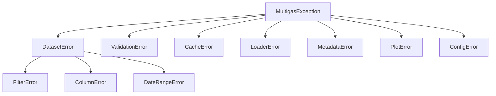

# Exceptions

Every package-specific exception in `multigas` derives from
`MultigasException`. Catching this base intercepts any `multigas`
failure without swallowing unrelated built-in exceptions. All
subclasses auto-log their message on construction — do **not** wrap a
raise site in `logger.error(...)`.

> Back to [Home](Home.md) · Related: [Logging](Logging.md), [API Reference → Exceptions](API-Reference.md#exceptions).

Module: `multigas.core.exceptions` (re-exported from `multigas.core`).

---

## Hierarchy

```
MultigasException                       # base — auto-logs on construction
├── DatasetError                        # parent of dataset-level errors
│   ├── FilterError                     # invalid filter or empty result
│   ├── ColumnError                     # missing / duplicated / wrong dtype
│   └── DateRangeError                  # bad or unapplicable date range
├── ValidationError                     # input fails a validation check
├── CacheError                          # cache read / write failure
├── LoaderError                         # source cannot be located / parsed
├── MetadataError                       # TOA5 metadata missing / unparsable
├── PlotError                           # plotting routine cannot render
└── ConfigError                         # package config missing / invalid
```



---

## Reference

| Exception | Parent | Raised when | Typical source |
|---|---|---|---|
| `MultigasException` | `Exception` | Base — catch to intercept any `multigas` failure. | Never raised directly; parent of every exception below. |
| `DatasetError` | `MultigasException` | Parent for dataset-level failures. Catch to handle any dataset-manipulation error at once. | Never raised directly. |
| `FilterError` | `DatasetError` | Filter expression is invalid or produces no rows. | Filter helpers (planned use — currently `Query.where` raises the built-in `ValueError` for an unknown comparator). |
| `ColumnError` | `DatasetError` | Column is missing, duplicated, or has the wrong dtype. Message lists every missing name plus the full available set. | `check_columns_exist`, `validate_dataframe_column`, `Query.where`, `Query.where_values_between`, `MultiGasData.add_wind_direction`, `MultiGasData.add_wind_quadrant`, `Query.select_columns` / `select_numeric_columns` (when `validate=True`). |
| `DateRangeError` | `DatasetError` | A requested date range cannot be applied to the dataset. | Reserved for future date-range validators. |
| `ValidationError` | `MultigasException` | Input data fails a validation check. | `to_dateime_index` (index-parse failure), `convert_to_wind_direction` / `convert_to_wind_quadrant` (bin miss). |
| `CacheError` | `MultigasException` | Cache read or write fails (typically wraps a lower-level joblib or filesystem error). | `save_cache`. Note: `DataLoader._load_from_cache` treats a corrupted cache as a **soft failure** — it deletes the bad file, logs a `WARNING`, and returns `None` so the caller reloads from source. |
| `LoaderError` | `MultigasException` | Source file cannot be located, parsed, or normalised, or `dataset_type` / `index_col` is invalid. | `DataLoader.load`, `DataLoader._load_csv`, `read_file`. |
| `MetadataError` | `MultigasException` | TOA5 (or equivalent) metadata cannot be extracted. | Reserved for future TOA5 metadata parser. |
| `PlotError` | `MultigasException` | A plotting routine cannot render its output. | Reserved for future plotting module. |
| `ConfigError` | `MultigasException` | Package configuration is missing or invalid. | Reserved for future `multigas.config` work. |

---

## Auto-Log Behaviour

Every subclass inherits this `__init__`:

```python
class MultigasException(Exception):
    _log_level: str = "ERROR"

    def __init__(self, *args: object) -> None:
        super().__init__(*args)
        attach_traceback = sys.exc_info()[0] is not None
        logger.opt(depth=1, exception=attach_traceback).log(
            self._log_level, f"{type(self).__name__}: {self}"
        )
```

Three consequences worth internalising:

1. **The `raise` site auto-logs.** No manual `logger.error(...)` before
   `raise <MultigasException>(...)` — the exception already logs the
   same message at its `_log_level`. A manual call duplicates the line
   and can drift out of sync with the message the caller sees.
2. **`depth=1` shifts the recorded frame** so the log's
   `{name}:{function}:{line}` slot points at your `raise`, not at
   `MultigasException.__init__` in this file. Log lines stay useful.
3. **Traceback is attached only when one exists.** `attach_traceback`
   is `True` only when an exception is genuinely being handled
   (`sys.exc_info()[0] is not None`), so:
   - `raise SomeError("msg")` produces one clean log line, no
     `NoneType: None` tail.
   - `raise SomeError("msg") from e` produces a full chained
     traceback in the log, so the `__cause__` is preserved.

If logging is disabled (`ENABLE_LOG != "true"` and no
`enable_logging()` call), the auto-log is a no-op because the logger
has no handlers. Raising still works; nothing is written.

---

## Overriding Severity

To lower the auto-log level for a specific subclass — for example, a
soft-warning case that shouldn't scream `ERROR` at ops dashboards —
override the class-level `_log_level` attribute:

```python
from multigas.core.exceptions import MultigasException

class StaleCacheWarning(MultigasException):
    _log_level = "WARNING"

raise StaleCacheWarning("cache older than 7 days; reloading")
# Logged at WARNING, still raised as an ordinary exception.
```

Valid loguru levels: `"DEBUG"`, `"INFO"`, `"WARNING"`, `"ERROR"`,
`"CRITICAL"`.

---

## Soft vs Hard Failures

Not every problem in `multigas` is worth an exception. The convention
(from `CLAUDE.md`, and the pattern to copy) is:

- **Hard failure** — the caller cannot make progress: `raise` a
  `MultigasException` subclass. It auto-logs at `ERROR` and the
  traceback surfaces the `raise` site.
- **Soft failure** — the caller wants to keep going and treat the
  problem as a recoverable outcome: return a sentinel (`None`, an
  empty collection) from the source function and log at `WARNING`
  there. Do **not** raise an exception the caller is guaranteed to
  swallow.

Live example — `DataLoader._load_from_cache`:

```python
except Exception as e:
    # Corrupted cache is a soft failure: delete the bad file, warn,
    # and return None so the caller falls back to reloading from
    # source without treating it as a real error.
    cache_path.unlink(missing_ok=True)
    logger.warning(f"Cache invalid, will reload: {cache_path} ({e})")
    return None
```

`DataLoader.load` sees the `None` and quietly reads from disk. No
exception surfaces to the user, no `ERROR` line pollutes the console.

---

## Catching Patterns

### Catch anything from `multigas`

```python
from multigas.core import MultigasException

try:
    ds = read_file(path, dataset_type="1min")
    ds.where("CO2", ">", 1.0).count()
except MultigasException as exc:
    # Every package-specific failure lands here; unrelated built-ins
    # (KeyError from your own code, RuntimeError from a dependency)
    # still propagate.
    handle(exc)
```

### Narrow to dataset-manipulation failures

```python
from multigas.core import DatasetError, MultigasException

try:
    ds.select_columns(["CO2", "S02"])   # typo — SO2 misspelled
    ds.where("SO2", ">", 1.0)
except DatasetError as exc:
    # Catches ColumnError, FilterError, DateRangeError together.
    ...
except MultigasException as exc:
    # Everything else the package raises.
    ...
```

### Match a specific case

```python
from multigas.core import ColumnError, LoaderError

try:
    ds = read_file("data/site_a.dat", dataset_type="1min", index_col="Time")
except LoaderError as exc:
    # File missing, TOA5/CSV parse failure, or "Time" not in the loaded
    # DataFrame.
    reload_with_default()
except ColumnError as exc:
    # Subsequent column-existence check failed.
    ...
```

### Preserve the cause chain

Always chain through `raise ... from e` when re-wrapping — the log
line includes the full `__cause__` traceback because of
`exception=True` in `MultigasException.__init__`:

```python
try:
    df = pd.read_csv(path)
except pd.errors.ParserError as e:
    raise LoaderError(f"Failed to parse {path}: {e}") from e
```

Never write `except X: raise Y(...)` without `from e` — you lose the
original stack, and downstream debugging turns into guesswork.

---

## What Not to Do

- **Never `logger.error(msg); raise MultigasException(msg)`.** The
  exception already logs `msg`; you'll get a duplicate line with a
  misleading frame (yours vs. the raise site's).
- **Never raise a `MultigasException` you know the caller will
  swallow.** Prefer the sentinel-plus-`WARNING` pattern shown in
  [Soft vs Hard Failures](#soft-vs-hard-failures).
- **Never bypass `check_columns_exist` with a hand-rolled
  `if col not in cols: raise ColumnError(...)`.** The utility batches
  every missing name into one message, which is dramatically more
  useful than a series of single-name raises. See
  [API Reference → `multigas.utils.validation`](API-Reference.md#multigasutilsvalidation).

---

## When to Add a New Exception

Add a new subclass when:

- The failure is recognisably its own category (callers will want to
  catch it separately from siblings).
- An existing class doesn't already cover the case — check the table
  above first; `ColumnError` and `LoaderError` between them cover
  most I/O and column mistakes.

When you add one, follow the pattern:

```python
class NewExceptionName(MultigasException):   # or DatasetError, etc.
    """One-line description of when this is raised.

    Example:
        >>> raise NewExceptionName("descriptive message")
        Traceback (most recent call last):
            ...
        multigas.core.exceptions.NewExceptionName: descriptive message
    """
    pass
```

Then add a row to the reference table above and — if it belongs in an
existing catch-all — mention it under [Hierarchy](#hierarchy).
