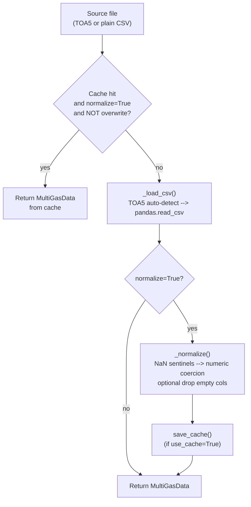

# Getting Started

A first-run guide for the `multigas` package: install it, load a file, and
run a few queries against the result.

> Back to [Home](Home.md) · See also [API Reference](API-Reference.md).

---

## Prerequisites

| Requirement | Notes |
|---|---|
| Python | 3.11 or newer (also tested on 3.12) |
| OS | Windows, macOS, or Linux |
| Package manager | [`uv`](https://docs.astral.sh/uv/) — the project uses `uv` exclusively; do **not** use `pip`, `pip install`, or `python -m pip` |

Runtime dependencies pulled in by `uv sync`: `pandas`, `numpy`,
`openpyxl`, `joblib`, `loguru`, `python-dotenv`, `python-slugify`,
`matplotlib`, `data-availability`.

---

## Installation

Clone the repository and install with `uv`:

```bash
# 1. Install the uv package manager (one time, per machine)
pip install uv

# 2. Clone
git clone https://github.com/martanto/multigas.git
cd multigas

# 3. Install runtime + dev dependencies
uv sync
```

`uv sync` reads `pyproject.toml` + `uv.lock`, creates a virtual
environment under `.venv/`, and installs everything the project needs.

Activate the venv before running Python directly (skip if you use
`uv run`, which resolves the env automatically):

```bash
# macOS / Linux
source .venv/bin/activate

# Windows (PowerShell)
.venv\Scripts\Activate.ps1

# Windows (cmd)
.venv\Scripts\activate.bat
```

Deactivate with `deactivate` when done.

Verify the install:

```bash
uv run python -c "import multigas; print(multigas.__version__)"
```

---

## First Load

The one-call convenience wrapper is `read_file`. It builds a `DataLoader`
under the hood and returns a `MultiGasData` — a class (from
`multigas.data.multigas_data`) wrapping the loaded `pd.DataFrame`, its
`DatasetType`, and the absolute source path.

```python
from multigas import read_file

ds = read_file("data/site_a.dat", dataset_type="1min")

ds.df.head()               # DataFrame indexed by pd.DatetimeIndex
ds.dataset_type            # <DatasetType.ONE_MINUTE: '1min'>
ds.source_path             # absolute Path to the source file
ds.start_date_str          # e.g. '2025-01-01'
ds.end_date_str            # e.g. '2025-01-31'
ds.numeric_columns         # list of numeric column names
```

The value passed to `dataset_type` is either a `DatasetType` member or its
string value. Sampling-interval members double as pandas frequency
aliases, so `"1s"`, `"2s"`, `"1min"`, `"6h"` are all valid, along with the
categorical modes `"zero"`, `"span"`, `"wx"`.

### What happens on load



The cache is keyed by `md5(absolute_path + mtime)` and stored under
`output/cache/*.pkl`. Stale (mtime/size changed) or corrupted entries
are dropped transparently — the loader logs a `WARNING` and reloads
from source.

---

## Full-Control Loading

Use `DataLoader` directly when you need to customise paths, disable
caching, or enable verbose logging.

```python
from multigas import DataLoader

loader = DataLoader(
    output_dir="output",        # <cwd>/output by default
    cache_dir="output/cache",   # <output_dir>/cache by default
    overwrite=False,            # True to bypass the cache lookup
    verbose=True,               # emit info log lines during loading
)

ds = loader.load(
    "data/site_a.dat",
    dataset_type="1min",
    index_col="TIMESTAMP",      # column promoted to the DatetimeIndex
    drop_empty_columns=False,   # True to drop all-NaN columns
    normalize=True,             # NaN-sentinel replacement + numeric coercion
    use_cache=True,             # read/write the joblib cache
)
```

See [API Reference → `DataLoader`](API-Reference.md#dataloader) for every
parameter's exact type, default, and behaviour.

---

## Fluent Queries

`MultiGasData` inherits from `Query`, so column selection, row filtering,
and inspection chain directly on the result. `Query` mutates its working
`df` in place; a pristine copy stays in `df_original` and can be
restored via `refresh()`.

### Select columns

```python
ds.select_numeric_columns().selected_columns
# ['CO2', 'SO2', 'H2S', ...]

ds.select_columns(["CO2", "SO2"]).df.columns.tolist()
# ['CO2', 'SO2']  (after .get() commits the selection)
```

`get()` commits the selection — it replaces `ds.df` with the
column-projected frame and recomputes `numeric_columns`. Dropped
columns only come back via `refresh()`.

### Filter rows

```python
# Simple comparator (any COMPARATOR alias works)
ds.where("CO2", ">", 1.0).count()

# Index-based (column_name == index name --> compares the DatetimeIndex)
ds.where("TIMESTAMP", ">=", "2025-01-01").count()

# Partial-string date slicing
ds.where_date("2025-01-15").count()               # a single day
ds.where_date_between("2025-01", "2025-02").count()  # two months, inclusive

# Numeric range on a column
ds.where_values_between("CO2", 0.5, 1.5).count()
```

The `where` comparator accepts symbolic, English, or Indonesian
aliases — see the [`COMPARATOR` table](API-Reference.md#constants-multigascoreconstant).

### Chain and commit

```python
(
    ds.where("CO2", ">", 1.0)
      .where_date_between("2025-01-01", "2025-01-31")
      .select_columns(["CO2", "SO2"])
      .get()          # narrows ds.df to the selected columns and returns it
)
```

### Undo

`refresh()` restores `ds.df` from `ds.df_original` and clears the
selection — it is the only way to bring dropped rows or columns back.

```python
ds.refresh()
ds.is_filtered()   # False
```

### Inspect

```python
ds.missing_columns    # columns with any NaN or empty string
ds.empty_columns      # columns that are all-NaN, all-zero, or all-empty
ds.column_has_missing("CO2")
ds.column_is_empty("unused_channel")
```

---

## Wind Analysis

If your dataset carries a bearings column (in degrees), `MultiGasData`
can attach a sector or quadrant label per row.

```python
# Add a compass-sector label (16 sectors by default)
ds.add_wind_direction("WD_deg", as_code=True, direction_to_use=16)
ds.df["wind_direction"].head()
# 0    NNE
# 1    NE
# 2    E
# ...

# Add a quadrant label (8 quadrants by default)
ds.add_wind_quadrant("WD_deg", as_code=False, quadrant_to_use=4)
ds.df["wind_quadrant"].head()
# 0    Quadrant I
# 1    Quadrant II
# ...
```

Bearings are normalised modulo 360, so `360.0`, `720.0`, and negative
values all wrap correctly. `NaN` bearings produce `None` (no row is
dropped).

---

## Exporting

`MultiGasData` can persist its current working DataFrame to disk in two
tabular formats. Both methods return the string path of the written
file, create the parent directory on demand, and default to writing
under `<cwd>/output/<format>/<dataset_type>/<source_stem>.<ext>` when
called with no argument.

```python
# Write CSV to output/csv/<dataset_type>/<source_stem>.csv
ds.to_csv()

# Write Excel to output/excel/<dataset_type>/<source_stem>.xlsx
ds.to_excel()

# Explicit path — suffix is appended if missing.
ds.to_csv("exports/site_a_filtered.csv")
ds.to_excel("exports/site_a_filtered.xlsx")
```

Excel output uses the `openpyxl` engine (a core runtime dependency).

### Extract one CSV per day

`extract_daily` splits the working DataFrame by calendar day and writes
one CSV per day under
`<output_dir>/daily/<DatasetType.label>/<source_slug>/<YYYY-MM-DD>.csv`
(where `DatasetType.label` is the hyphenated form such as
`"one-minute"` and `<source_slug>` is the slugified source file stem),
returning a summary of per-day stats (row count and completeness
percentage). Next to the daily folder it also writes:

* `<source_slug>-completeness.csv` — the aggregated summary (always);
* `<source_slug>-completeness.png` — a daily-availability chart of that
  summary (when `plot=True`, the default; a plotting failure only logs
  a `WARNING`);
* `<source_slug>.json` — the raw stats list (when `return_as_list=True`).

```python
# Write daily CSVs under <cwd>/output/daily/<DatasetType.label>/<source_slug>/
# and <source_slug>-completeness.csv / .png one level up
summary = ds.extract_daily()

summary.head()
#          date  total_data  completeness
# 0  2025-01-01        1440         100.0
# 1  2025-01-02        1200          83.33
# 2  2025-01-03           0           0.0   # missing day — logged as WARNING

# Or pick a custom root and get the raw list back;
# the list is additionally written as <source_slug>.json
stats = ds.extract_daily("exports/", return_as_list=True)

# Parallelise per-day extraction (helpful for large multi-year 1s / 2s runs)
summary = ds.extract_daily("exports/", n_jobs=4)

# Incremental re-runs — keep every day whose CSV already exists on disk,
# re-write only the new / missing ones. Good for a nightly extract job
# that reprocesses the same range without rewriting historical days.
summary = ds.extract_daily("exports/", overwrite=False)

# Skip the completeness PNG (avoids importing matplotlib)
summary = ds.extract_daily("exports/", plot=False)
```

To re-plot an existing summary on its own:

```python
from multigas.plot import plot_completeness

plot_completeness("exports/daily/one-minute/site-a-completeness.csv")
```

`completeness` is computed by [`calculate_completeness`](API-Reference.md#multigasutilsdataframe)
against `DatasetType.total_data`; over-sampled days are capped at
`100.0` and log a `WARNING`. Missing days (no rows for that date) get
`total_data=0` / `completeness=0.0` and are enumerated in a single
`WARNING` line at the end of the run.

`n_jobs > 1` dispatches per-day extraction to `joblib.Parallel`
with the `loky` backend, capped at `max(1, os.cpu_count() - 2)`.
Results stay date-ordered; per-day `verbose` logs are suppressed
in workers to avoid interleaved multi-process output.

`overwrite=False` skips the write for any day whose CSV already
exists under `<output_dir>/daily/<DatasetType.label>/<source_stem>/`
and instead reconstructs the row from the file's line count via
[`count_csv_rows`](API-Reference.md#multigasutilsdataframe), so
the returned per-day shape stays one row per calendar day. The
number of skipped days is logged at `INFO`.

---

## Enabling Logging

The package's `loguru` logger is silent by default. Handlers are only
registered when the `ENABLE_LOG` environment variable is `"true"`.

```bash
# One-off run
ENABLE_LOG=true uv run python your_script.py

# Or add to .env at the repo root:
# ENABLE_LOG=true
```

Or toggle at runtime:

```python
from multigas.logging import enable_logging, set_log_level

enable_logging()               # console + file sinks
set_log_level("DEBUG")         # verbose console output
```

Full details in [`Logging`](Logging.md).

---

## Handling Errors

Every package-specific exception derives from `MultigasException` and
auto-logs its message on construction. Catch broadly with:

```python
from multigas.core import MultigasException, LoaderError, ColumnError

try:
    ds = read_file("data/missing.dat", dataset_type="1min")
except LoaderError as e:
    # file missing, TOA5/CSV parse failure, or bad index_col
    print(f"Load failed: {e}")
except MultigasException as e:
    # any other package failure
    print(f"multigas error: {e}")
```

Full hierarchy and per-class raise conditions in [`Exceptions`](Exceptions.md).

---

## Development Workflow

```bash
uv sync                                     # install deps
uv run ruff check --fix src/                # lint + auto-fix
uvx ty check src/                           # type check (ty, not mypy)
uv run pytest tests/                        # run test suite
uv run pytest tests/test_imports.py -v      # circular-import check
```

Run the circular-import check after any module or import change — this
is repo rule 8.

---

## Where to Next

- [API Reference](API-Reference.md) — every public callable with parameter tables
- [Logging](Logging.md) — sink layout, retention, runtime toggles
- [Exceptions](Exceptions.md) — full hierarchy, auto-log behaviour, when each is raised
