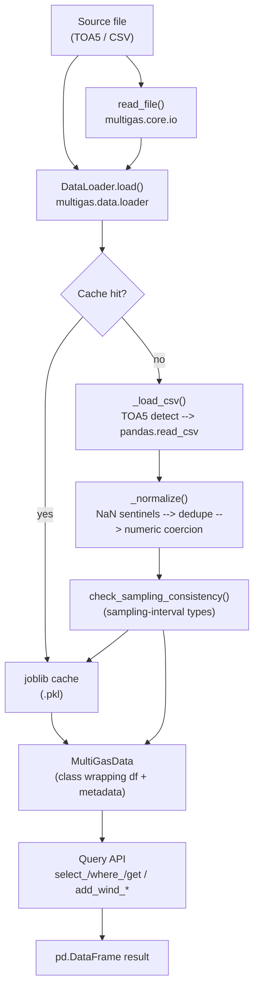

# multigas — Wiki

Living single-source-of-truth documentation for the `multigas` package.

`multigas` is an early-stage Python package for processing and analyzing
multi-gas volcanic monitoring data (CO2, SO2, H2S) from Campbell Scientific
dataloggers. Every dataset flowing through the package is inherently
**time-series** and is expected to carry a `pd.DatetimeIndex`.

---

## Navigation

| Page | Purpose |
|---|---|
| [Home](Home.md) | Overview, repository map, navigation, glossary |
| [Getting Started](Getting-Started.md) | Install, first load, fluent queries, wind analysis, dev workflow |
| [API Reference](API-Reference.md) | Public methods, signatures, and parameter tables |
| [Data Columns](Data-Columns.md) | Per-column dictionary for the datalogger's TOA5 / CSV output — meaning, units, and onboard processing |
| [Wind Analysis](Wind-Analysis.md) | Sector / quadrant tables, bearing normalisation, `add_wind_direction` / `add_wind_quadrant` contracts |
| [Logging](Logging.md) | Sink layout, retention, runtime toggles, `ENABLE_LOG` contract |
| [Exceptions](Exceptions.md) | Hierarchy, auto-log behaviour, soft vs hard failures, catching patterns |

> Additional pages (e.g. `Data-Loading.md`, `Query-API.md`,
> `Caching.md`, `Contributing.md`) will be added as the packages /
> project are completed. Add new pages here as rows in the table
> above so this index stays the single navigation entry point.

---

## Repository Map

```
multigas/
├── src/multigas/                # Package (src layout)
│   ├── __init__.py              # Public exports: read_file, DataLoader, version
│   ├── logging.py               # Preconfigured loguru logger + toggles
│   ├── config/                  # Configuration (stub)
│   ├── core/
│   │   ├── __init__.py          # Re-exports DatasetType, enums, type aliases, exceptions
│   │   ├── types.py             # Enums and type aliases
│   │   ├── query.py             # Query — fluent column/filter mixin
│   │   ├── constant.py          # COMPARATOR + WIND_DIRECTIONS_* / WIND_QUADRANTS_*
│   │   ├── io.py                # read_file — one-call convenience wrapper
│   │   └── exceptions.py        # MultigasException hierarchy (auto-logs on raise)
│   ├── data/
│   │   ├── __init__.py          # Re-exports DataLoader, MultiGasData
│   │   ├── loader.py            # DataLoader — file I/O, normalisation, joblib cache
│   │   └── multigas_data.py     # MultiGasData — DataFrame + provenance wrapper (extends Query)
│   ├── plot/
│   │   ├── __init__.py          # Re-exports plot_completeness
│   │   └── plot_completeness.py # plot_completeness — daily-completeness PNG
│   └── utils/
│       ├── __init__.py          # Docstring-only; import helpers directly
│       ├── path.py              # ensure_dir
│       ├── cache.py             # get_cache_key / get_cache_path / save_cache / load_cache / clear_cache
│       ├── validation.py        # check_columns_exist, validate_dataframe_column, check_sampling_consistency
│       └── dataframe.py         # to_datetime_index, get_dates, convert_to_wind_*, calculate_completeness, count_csv_rows
├── tests/                       # Pytest suite (and where all test output belongs)
├── wiki/                        # This documentation
├── changelogs/                  # Daily task log (git-ignored, local only)
├── pyproject.toml               # Project metadata, deps, uv build config
├── ruff.toml                    # Lint config (rules E, W, F, I, B, C4, UP, NPY, PD)
├── ty.toml                      # ty type-checker config
├── CLAUDE.md                    # Repo-level agent guidance
└── README.md                    # Public README
```

---

## Package Architecture



Public entry points live at the top of the package:

- **`multigas.read_file`** — one-call convenience wrapper.
- **`multigas.DataLoader`** — full-control loader with cache management.

Both return a **`MultiGasData`** — a class (from
`multigas.data.multigas_data`) that wraps the loaded DataFrame together
with its `DatasetType`, absolute source path, and `Query` mixin for
fluent column selection, row filtering, and wind analysis.

---

## Quick Start

```python
from multigas import read_file

ds = read_file("data/site_a.dat", dataset_type="1min")

ds.df.head()                       # underlying DataFrame (DatetimeIndex)
ds.dataset_type                    # <DatasetType.ONE_MINUTE: '1min'>
ds.source_path                     # absolute Path to the source file

# Fluent selection + filtering (Query mixin)
(
    ds.where("CO2", ">", 1.0)
      .where_date_between("2025-01-01", "2025-01-31")
      .select_columns(["CO2", "SO2"])
      .get()                       # commits the selection and returns the DataFrame
)

ds.refresh()                       # restore the pristine df_original
```

For full-control loading:

```python
from multigas import DataLoader

loader = DataLoader(
    output_dir="output",
    cache_dir="output/cache",
    overwrite=False,
    verbose=True,
)
ds = loader.load("data/site_a.dat", dataset_type="1min")
```

---

## Common Commands

```bash
uv sync                                     # install deps (including dev)
uv run main.py                              # run entry point
uv run ruff check --fix src/                # lint + auto-fix
uvx ty check src/                           # type check
uv run pytest tests/                        # run test suite
uv run pytest tests/test_imports.py -v      # circular-import check
```

---

## Glossary

| Term | Meaning |
|---|---|
| **TOA5** | Campbell Scientific LoggerNet ASCII table format — a first-line `"TOA5"` marker followed by header, units, sampling, and data rows |
| **DatasetType** | Enum whose string values are pandas frequency aliases (`"1s"`, `"2s"`, `"6h"`, `"1min"`) plus categorical modes (`"zero"`, `"span"`, `"wx"`). Exposes `.total_data` (expected records per day for sampling-interval members) and `.label` (hyphenated form such as `"one-minute"`, used as a path segment by `extract_daily`) |
| **MultiGasData** | Class wrapping a loaded DataFrame + provenance metadata; lives in `multigas.data.multigas_data` and extends `Query` so all fluent helpers live directly on the result |
| **Query** | Mixin providing fluent column selection, row filtering, and null / empty inspection. Mutates its working `df` in place; `df_original` is the pristine copy restored by `refresh()` |
| **COMPARATOR** | List of accepted comparator aliases for `Query.where()` — symbolic (`">="`), English (`"greater than"`), and Indonesian (`"lebih besar sama dengan"`) |
| **normalise** | Replace `"NAN"` / `"NaN"` / `""` string sentinels with `np.nan`, drop rows with a missing `RECORD`, drop rows with a duplicated `TIMESTAMP` (keeping the last), and coerce object-dtype columns to numeric where possible. For sampling-interval `DatasetType`s the loader then keeps only rows whose spacing matches the expected interval (`check_sampling_consistency`) |
| **completeness** | Per-day row count divided by `DatasetType.total_data`, as a percentage capped at `100`. Produced by `extract_daily` and plotted by `plot_completeness` |
| **cache** | On-disk `joblib` pickle keyed by `md5(absolute_path + mtime)`; stored under `output/cache/*.pkl`. Stale or corrupted entries are dropped transparently |
| **ENABLE_LOG** | Environment variable (`"true"`/`"false"`) that gates loguru handler registration in `multigas.logging` |

---

## Related Files

- [`README.md`](../README.md) — Public-facing intro and installation
- [`CLAUDE.md`](../CLAUDE.md) — Agent guidance (rules, code style, commands)
- [`API Reference`](API-Reference.md) — Full public API with parameter tables
